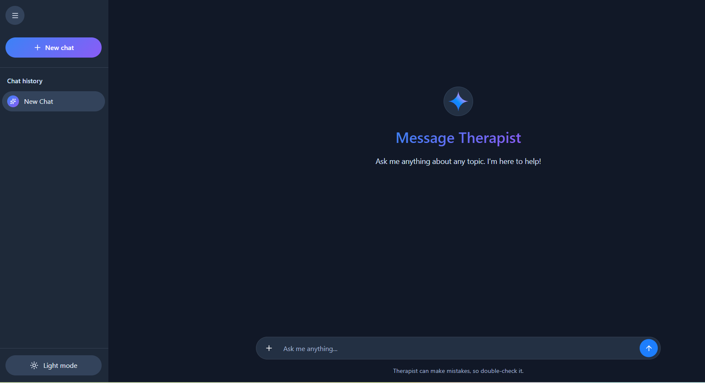

# Virtual Therapist Voice

An AI-powered online therapy platform that enables patients to communicate with a virtual therapist through both text and voice conversations. The application provides a modern, responsive interface and leverages OpenAI to generate intelligent and natural responses.

## Live Demo

**Demo:** https://therapist-voice.vercel.app/

> **Note**
>
> The current demo uses a free OpenAI API key with limited quota. As a result, AI responses may not function correctly. To experience the full functionality, configure your own valid OpenAI API key in the deployment environment.

---

## Features

* AI-powered therapist conversations
* Voice and text interaction
* Natural typing animation
* Modern and responsive UI
* Real-time chat experience
* Secure server-side API integration
* Next.js App Router architecture
* Easy deployment with Vercel

---

## Technology Stack

### Frontend

* Next.js 16
* React 19
* TypeScript
* CSS

### Backend

* Next.js API Routes
* OpenAI API

### Deployment

* Vercel

---

## Screenshots

### Home

<p align="center">
  
</p>

---

## Running Locally

Clone the repository.

```bash
git clone https://github.com/techsavvy87/therapist-voice.git
```

Install dependencies.

```bash
npm install
```

Create a `.env.local` file.

```env
OPENAI_API_KEY=your_openai_api_key
```

Start the development server.

```bash
npm run dev
```

Visit:

```
http://localhost:3000
```

---

## Environment Variables

| Variable       | Description    |
| -------------- | -------------- |
| OPENAI_API_KEY | OpenAI API Key |

---

## Project Structure

```
app/
 ├── api/
 │    └── chat/
 │         └── route.ts
 ├── page.tsx
 ├── layout.tsx
 └── globals.css
```

---

## Security

* API keys are stored securely using Vercel Environment Variables.
* OpenAI requests are processed through server-side API routes.
* Sensitive credentials are never exposed to the client.

---

## Future Improvements

* Therapist authentication
* Patient accounts
* Conversation history
* Voice transcription
* Appointment scheduling
* Medical report generation
* Multi-language support

---

## License

This project is intended for demonstration and educational purposes.
